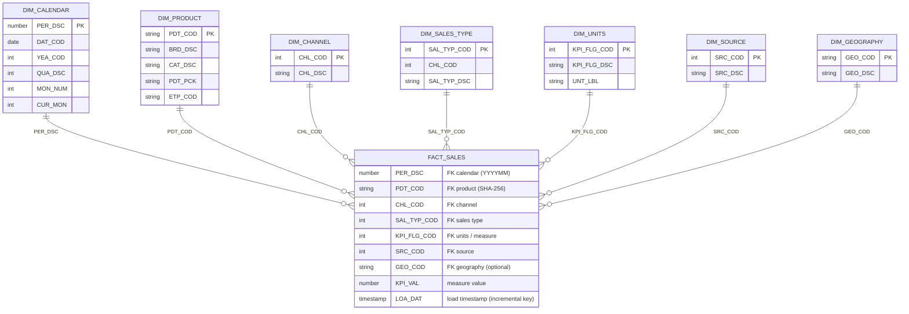

# Data Model

The warehouse follows a **star schema**. Source panels are normalized into **fact tables**
at a consistent grain and joined to a set of **conformed dimensions** shared across both
markets (ES / PT). The Gold marts are what the Power BI model consumes.

## Grain

One fact row = **one measure value for one product, in one channel, for one sales type,
in one period, from one source**.

```
PER_DSC (period) x PDT_COD (product) x CHL_COD (channel)
x SAL_TYP_COD (sales type) x SRC_COD (source) [x GEO_COD for geo-aware panels]
```

## Two measure-modelling styles (by design)

The panels deliver measures differently, so the facts keep two shapes and the Gold layer
reconciles them:

| Style | Used by | Measure columns |
|-------|---------|-----------------|
| **Wide** (one column per measure) | PT panels | `SO_VALUES` (EUR), `SO_UNITS`, `SO_KILOS` |
| **Tall / flag-based** (one value + a measure flag) | ES panels | `KPI_VAL` + `KPI_FLG_COD` → resolved via `DIM_UNITS` |

The tall style scales better when a panel can add new measure types without a schema change;
the wide style is simpler for panels with a fixed, small set of measures.

## Conformed dimensions

| Dimension | Key | Notes |
|-----------|-----|-------|
| `DIM_CALENDAR`   | `PER_DSC` / `DAT_KEY` | Generated programmatically; day→year grains, ISO week, LY shifts, boundary flags. |
| `DIM_PRODUCT`    | `PDT_COD` | SHA-256 surrogate key; cross-references every panel's product code + EAN. Latest version kept (`QUALIFY`). |
| `DIM_CHANNEL`    | `CHL_COD` | Resolved per source from the channel mapping tables. |
| `DIM_SALES_TYPE` | `SAL_TYP_COD` | Parent channel derived from the first digit (hierarchical code). |
| `DIM_UNITS`      | `KPI_FLG_COD` | Measure catalogue: Volume (Kg), Volume (L), Value (EUR), Units. |
| `DIM_SOURCE`     | `SRC_COD` | Which panel a fact row came from. |
| `DIM_GEOGRAPHY`  | `GEO_COD` | SHA-256 of the geography label; only for geo-aware panels (e.g. PT `PANEL_B`). |

### Surrogate keys & the `99` fallback

- **Product / geography keys** are `SHA2(UPPER(TRIM(<natural key>)), 256)` — stable across
  loads, case/whitespace-insensitive.
- Every mapped dimension carries a reserved **`99` "Not Assigned"** member. Fact lookups use
  `COALESCE(<code>, 99)`, so a fact row is never dropped because a mapping is missing — it is
  attributed to `99` and remains auditable.

## Entity relationship (conformed consumption model)



> `FACT_SALES` above is the conceptual conformed fact. In the warehouse it is materialized
> per source/market (`FACT_ES_PANEL_F…I`, `FACT_PT_PANEL_A…D`) and unified in the Gold
> marts (`FACT_PT_TOP2`, `FACT_PT_NACIONAL`).

## Lineage (one source, end to end)

```
BRONZE_STG.STG_<market>_<panel>          -- raw, as delivered
        │  dedup (ROW_NUMBER) + incremental window (LOA_DAT)
        ▼
SILVER_DWH.FACT_<market>_<panel>         -- normalized, keyed, mapped to 99-fallback dims
        │  union across feeds / panels, product mastering
        ▼
SILVER_TRA.TRA_<market>_<panel>          -- cross-source reshaping
        │  resolve to a single product key, cast period
        ▼
GOLD_DMT.FACT_<market>_<view>            -- business-ready, consumed by Power BI
```

## Power BI consumption

The Power BI model is a star over the Gold marts plus the conformed dimensions, with a few
disconnected **parameter tables** (field/measure/period pickers) driving dynamic measure and
axis selection in the report. The synthetic dataset used to reproduce the dashboards mirrors
this exact model (`DIM_*` + `FACT_TABLE` + parameter helper tables).
